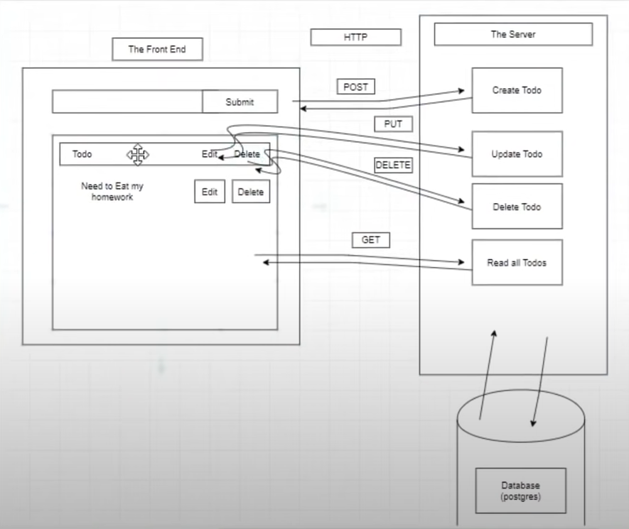

# Crash Course PERN

https://www.youtube.com/watch?v=ldYcgPKEZC8

## Intro

- We are gonna build a simple PERN To Do List

## Overview Diagram

- Just remembering that the Restful API is responsible for **instructing** the database about what CRUD operations should be done

## Bulding the Server

- npm install express pg cors
- npm install --save-dev nodemon

### Observations and new things learned:

- cors package

  - cors package middleware abstracts the configuration of the headers

- app.use(express.json()); // Gives us access to the req body
  - Since express 4.16, there's no need to install body-parser

## Creating Postgres DB and Table

- Main commands:

  - psql -U postgres to enter in postgres
  - \! cls => clear
  - \l => list all database in postgresql
  - \c => move inside a database
  - \dt => show table in database
  - CREATE DATABASE nameiwant; => create a database with the name I want
  - CREATE TABLE anynameiwant; => create the table called todo

- Steps:
  - Created the database.sql file with the query
  - Open terminal
    - psql -U postgres
    - Run the query in the terminal

## Connect Postgres DB and Server

- Create and export the pool in the db.js file

## Build Routes with Posgres queries

- No secrets here, just check the API

**Obs.:** I didn't work on the front end, as I just wanted to understand the Postgres application
